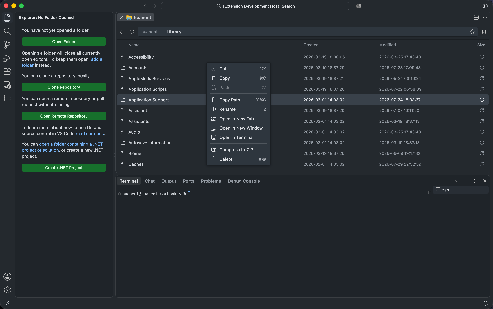

	
	<h1>Folder Viewer</h1>
	
Browse and manage folders in full-size VS Code editor tabs.

	

		
	

Folder Viewer adds a file-manager view to the editor area without replacing the built-in Explorer. Each folder opens in an independent tab, giving you more space to browse files, compare folders, and perform common file operations without leaving VS Code.

## Features

- **Editor tabs:** Open multiple folders in independent, full-size tabs.
- **Navigation:** Move through folders with breadcrumbs, back navigation, refresh, and favorites.
- **File details:** View creation time, modification time, and file size. Calculate folder sizes on demand.
- **File operations:** Cut, copy, paste, rename, move to trash, permanently delete, and copy absolute paths.
- **Folder actions:** Open a folder in another Folder Viewer tab, a new VS Code window, or the integrated terminal.
- **ZIP archives:** Compress selected files and folders or extract ZIP files with progress and cancellation.
- **Selection:** Use single, range, and multi-selection with familiar mouse and keyboard controls.

## Open a Folder

| Method | Action |
| --- | --- |
| Explorer | Right-click a folder and select **Open in Folder Viewer**. |
| Command Palette | Run **Open in Folder Viewer**, then choose a folder. |
| Keyboard | Press `Cmd+Shift+;` on macOS or `Ctrl+Shift+;` on Windows and Linux to open your home folder. |

Each Folder Viewer tab is limited to the folder it was opened with and its descendants.

## Browse and Manage Files

- Double-click a folder to enter it.
- Double-click a file to open it with its registered VS Code editor.
- Double-click a ZIP file to extract it.
- Use the star in the path bar to add or remove the current folder from favorites.
- Click the size button beside a folder to calculate its size. Hold `Cmd` on macOS or `Ctrl` on Windows and Linux while clicking to calculate all visible folder sizes.
- Right-click an item or empty space to open the context menu.

### Context Menu

Depending on the selection, the context menu provides:

| Category | Actions |
| --- | --- |
| Clipboard | Cut, copy, paste, and copy absolute paths |
| Item management | Rename, move to trash, or permanently delete by holding `Shift` while choosing **Delete** |
| Folder tools | Open in a new Folder Viewer tab, open in a new VS Code window, or open in the integrated terminal |
| Archives | Compress the selection to a ZIP file or extract a selected ZIP file |

## Behavior Notes

- Each tab is scoped to the folder it was opened with. Navigation and file operations stay inside that root folder.
- ZIP files open with extract behavior on double-click. Use the context menu to compress selected files or folders.
- When moving items to trash is not supported by the current file system provider, Folder Viewer asks before falling back to permanent deletion.
- Remote and virtual workspaces depend on the capabilities exposed by their VS Code file system provider, so some operations may be unavailable or slower than local folders.

## Keyboard Shortcuts

| Action | macOS | Windows / Linux |
| --- | --- | --- |
| Select all | `Cmd+A` | `Ctrl+A` |
| Add to selection | `Cmd+Click` | `Ctrl+Click` |
| Select a range | `Shift+Click` | `Shift+Click` |
| Cut | `Cmd+X` | `Ctrl+X` |
| Copy | `Cmd+C` | `Ctrl+C` |
| Paste | `Cmd+V` | `Ctrl+V` |
| Copy path | `Option+Cmd+C` | `Shift+Alt+C` |
| Go to path | `Cmd+Shift+G` | `Ctrl+Shift+G` |
| Rename selected item | `F2` or `Enter` | `F2` or `Enter` |
| Move to trash | `Cmd+Backspace` | `Delete` |
| Delete permanently | `Shift+Cmd+Backspace` | `Shift+Delete` |
| Clear selection | `Escape` | `Escape` |

Keyboard shortcuts apply while focus is inside the Folder Viewer tab.

## License

[MIT](LICENSE.txt)
